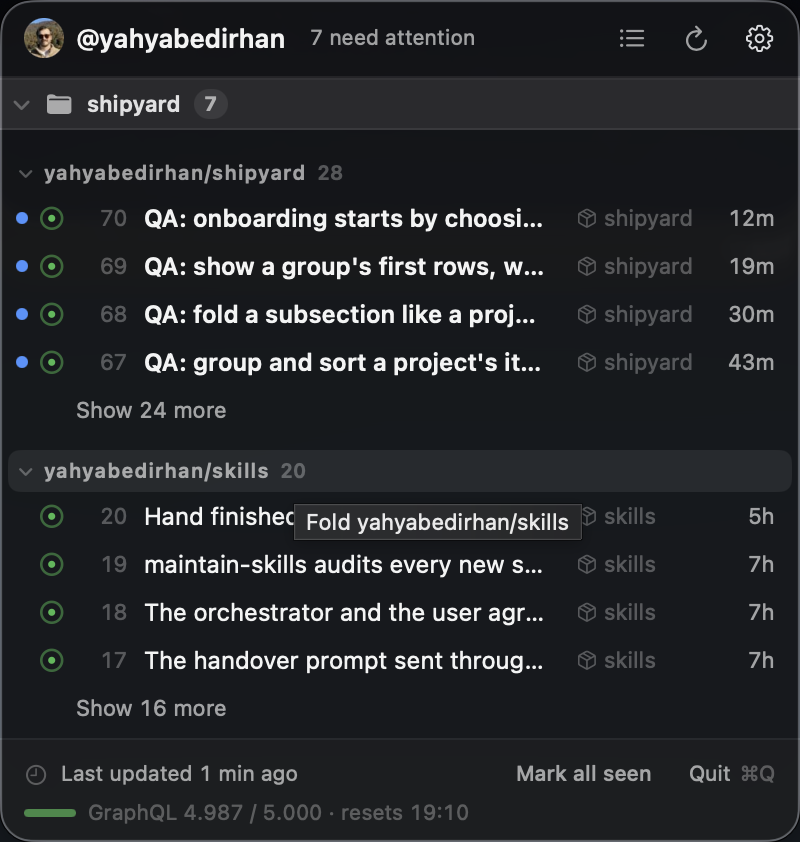
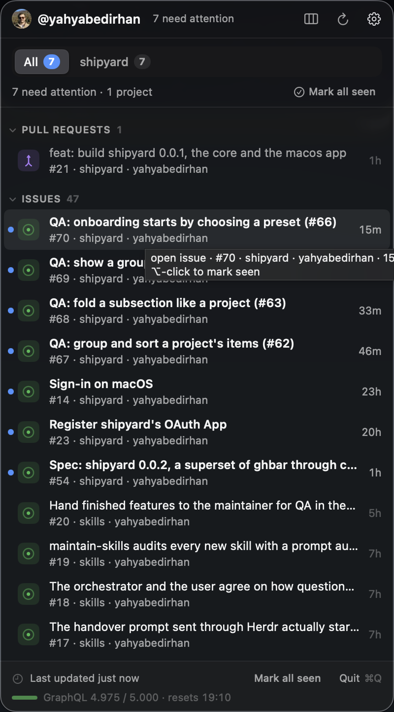
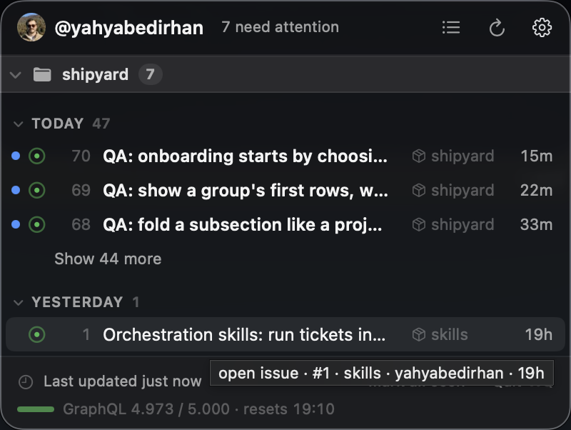
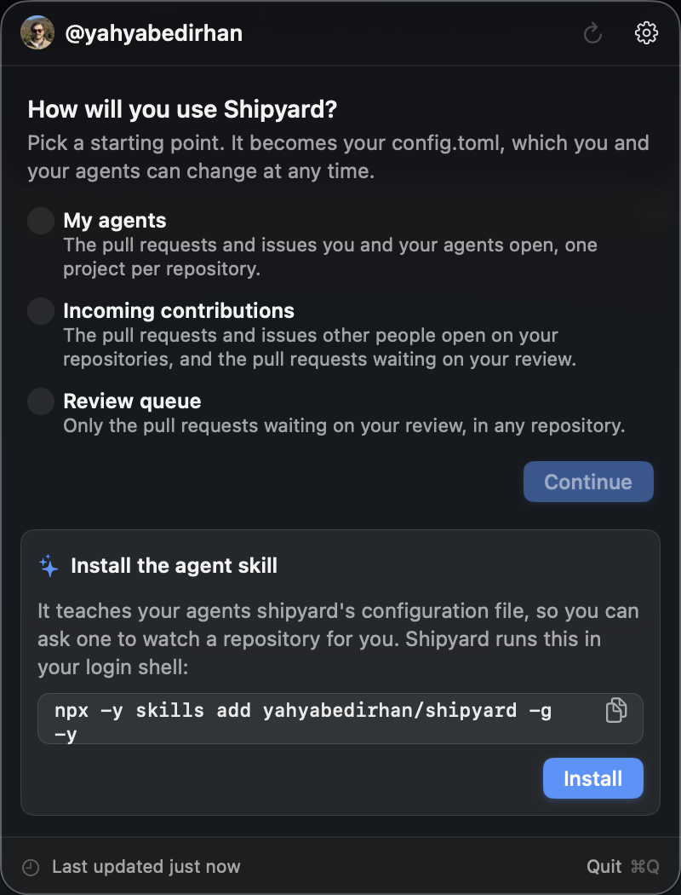

# shipyard

A macOS menu bar app for seeing and reviewing the pull requests your agents open on your behalf.

**Status:** under construction. Versions stay at 0.0.x until the public launch; this README describes 0.0.2.

## Why it exists

When coding agents work for you, they open pull requests and issues and start workflow runs, often several at once and across several repositories. Other people open them too. Keeping track means checking GitHub page after page to find what is new, what changed, and what is waiting on you.

Shipyard keeps that in one place, in the menu bar:

- It lists the pull requests (and, if you turn them on, the issues and workflow runs) of the repositories you choose, from anyone, you and your agents included.
- The menu bar shows one number: how many items still need your attention. An item needs attention when you haven't opened it yet, when it changed since you last opened it, when it asks for your review, or when its checks failed.
- It sends a macOS notification for the events you pick, such as a new pull request or a failed run.
- Clicking an item opens it on GitHub and marks it seen.

Everything it shows, and when it notifies you, lives in one commented TOML file that you edit, or ask your agents to edit. There is no settings window: the file is the whole interface, and shipyard applies each save at once.

## Install

### Requirements

- **macOS 14** or later. Shipyard ships for macOS only.
- **To build from source: the Command Line Tools with Swift 6 or later** (`xcode-select --install`; `swift --version` says which you have). The package uses Swift tools version 6.0; Xcode isn't needed.
- **A GitHub account, with the [GitHub CLI](https://cli.github.com) signed in.** Shipyard picks up `gh`'s token on its own:

  ```sh
  brew install gh
  gh auth login
  ```

  **Sign in with GitHub** from the panel (GitHub's device flow: you enter a code on github.com, and shipyard keeps the token in your login Keychain) is coming. It is built, but switched off until shipyard's OAuth App is registered ([#23](https://github.com/yahyabedirhan/shipyard/issues/23)); until then the panel shows it as unavailable and connects through `gh`.

### From source

```sh
git clone https://github.com/yahyabedirhan/shipyard.git
cd shipyard
make install    # builds, ad-hoc signs, copies Shipyard.app to /Applications and opens it
```

### From a release zip

There's no GitHub release yet, so build the zip yourself with `make release` in a clone (it runs the tests and writes `build/Shipyard-<version>-macos.zip`). The zip is ad-hoc signed, not notarized, so macOS blocks the first launch of a copy that was downloaded. Unzip it, move `Shipyard.app` to `/Applications`, clear the quarantine flag and open it:

```sh
unzip Shipyard-<version>-macos.zip
mv Shipyard.app /Applications/
xattr -dr com.apple.quarantine /Applications/Shipyard.app
open /Applications/Shipyard.app
```

Or, on macOS 15 and later, open it once, dismiss the warning, then choose **Open Anyway** in System Settings > Privacy & Security.

### First launch

Shipyard has no Dock icon: it lives in the menu bar. Click its icon to open the panel.

1. Until it's connected to GitHub, the panel shows the `gh` command to run, with a **Try again** button.
2. It then asks how you will use shipyard and offers three starting points, called presets (see the [last example](#examples)): **My agents**, **Incoming contributions** and **Review queue**. The one you pick becomes your configuration file. **My agents** then asks which repositories to watch (pick from yours, or type `owner/name`; give several the same project name to group them), **Incoming contributions** watches all your repositories or the ones you pick, and **Review queue** needs none.
3. The first time something is worth notifying, macOS asks whether shipyard may send notifications. If you decline, the panel says notifications are off, with a button to System Settings.

Shipyard starts at login: it registers itself as a login item when it launches. Set `launch-at-login = false` in the configuration to remove it; switching it off in System Settings > General > Login Items also sticks.

### Update

From source, pull and install again (it quits the running copy first):

```sh
git pull
make install
```

From a zip, quit shipyard, delete the old copy (`rm -rf /Applications/Shipyard.app`), then install the newer zip as [above](#from-a-release-zip).

### Uninstall

1. Quit shipyard (**Quit** in its panel, or ⌘Q while it's open).
2. Delete the app: `rm -rf /Applications/Shipyard.app`.
3. If it's still listed in System Settings > General > Login Items, remove it there.
4. Delete its configuration and state:

   ```sh
   rm -rf ~/.config/shipyard ~/Library/Application\ Support/Shipyard
   ```

5. If you installed the agent skill, remove it:

   ```sh
   npx skills remove shipyard -g
   ```

6. macOS may keep a Shipyard entry under System Settings > Notifications after the app is gone. It's harmless, and System Settings has no button to remove it; leave it, or turn its notifications off there.

`gh` stays signed in; run `gh auth logout` if you want that too. If you used a build with Sign in with GitHub turned on, **Sign out** in the gear menu deletes its token from the Keychain; after the app is gone, run `security delete-generic-password -s com.yahyabedirhan.shipyard -a github-token`.

## Use

### In the menu

- The number in the menu bar counts the items that still need your attention.
- Click an item to open it on GitHub and mark it seen; **⌥-click** marks it seen without opening it. **Mark all seen** clears the count.
- **↑** and **↓** move through the projects and items; **Return** opens the highlighted item and **⌥Return** marks it seen. In the list, **←** collapses a project and **→** expands it. In tabs, **←** and **→** switch tabs.
- **⌘R** refreshes now; otherwise shipyard refreshes on its own, within a share of GitHub's rate limit that you set.
- The button beside Refresh switches between the list and tabs layouts.

### The configuration file

Everything lives in `~/.config/shipyard/config.toml` (`$XDG_CONFIG_HOME/shipyard/` when that's set). **Open configuration file**, in the panel's gear menu, opens it. Every key is optional, edits apply as soon as you save, and a broken edit keeps the last valid configuration and shows the error in the panel. What you've seen is kept apart, in `~/Library/Application Support/Shipyard/`.

What you can set, at a glance:

- **Projects.** Each `[[projects]]` block is one section of the menu, with a name and its `repositories`. A repository is `owner/name`; `my-org/*` is everything an owner has; `owned`, `organizations` and `collaborator` are your own repositories, your organizations', and other people's you collaborate on. Groups and wildcards pick up new repositories within the hour. `anywhere` lists the pull requests waiting on your review in any repository.
- **Layouts.** `[menu] layout = "list"` (the default) puts every project in one scrolling list; `"tabs"` shows one project at a time, after an All tab.
- **What's shown.** Pull requests are shown by default; issues and workflow runs are turned on with `show = true`. Each kind can be narrowed by author (`authors = { hide = ["me", "bots"] }` for what other people open), by state (`states = ["open"]`), and pull requests to those waiting on your review (`review-requested = true`). Set these in `[defaults.pull-requests]`, `[defaults.issues]` and `[defaults.workflow-runs]` for every project, or inside one project's block.
- **Arranging.** `group-by` groups a project's items by `"kind"` (the default), `"repository"`, `"date"`, `"author"` or `"none"`; `sort-by` sorts them by `"updated"`, `"created"` or `"title"`; `subsections = true` puts a header over each group; and `show-first = 5` shows each group's first five rows with a Show more row. Set them under `[defaults]`, or per project.
- **Notifications.** A list of rules, each an event (`pr.opened`, `pr.merged`, `run.failed`, `issue.opened`, …) and, optionally, whose items it covers. By default, a new pull request in any project notifies.
- **Presets.** Three ready-made files for the main uses, offered when shipyard starts with no configuration: [skills/shipyard/presets.md](skills/shipyard/presets.md) has each one in full.

For every key, its default and its allowed values:

- [`skills/shipyard/SKILL.md`](skills/shipyard/SKILL.md), the agent skill, is also the reference for people: every key, author and repository selectors, notification events, and worked examples.
- [`schema/config.schema.json`](schema/config.schema.json) documents every key and default. Name it on the file's first line (`#:schema https://raw.githubusercontent.com/yahyabedirhan/shipyard/main/schema/config.schema.json`) for completion in your editor and for `taplo check`.
- [`docs/configuration.md`](docs/configuration.md) is for maintainers: how configuration works in the code, and every place to touch when adding a setting.

## Use it with an agent

Shipyard comes with an agent skill that teaches coding agents (Claude Code, Codex and others that read skills) its configuration file: where it is, which keys exist, how to edit it without losing your comments, and how to check the edit.

1. Install the skill, from a terminal:

   ```sh
   npx skills add yahyabedirhan/shipyard -g -y
   ```

   or from the panel: onboarding offers it, and **Install agent skill…** in the gear menu runs the same command.

2. Ask your agent to change your shipyard, in your own words. For example:

   - "Watch this repo in shipyard."
   - "Group my frontend and backend repositories into one project."
   - "Hide dependabot's pull requests."
   - "Show CI runs for this project and tell me when they fail."
   - "Switch shipyard to tabs."

The agent edits `config.toml`, checks it against the schema, and reads shipyard's verdict on the save, so a mistake shows up in the conversation rather than only in the panel.

## Examples

Each configuration below is what produced the screenshot beside it, trimmed to the lines that matter. The first three share one project that watches two repositories, with issues turned on.

<table>
<tr>
<th>Configuration</th>
<th>Result</th>
</tr>
<tr>
<td>
<p>The list layout, grouped by repository under subheaders, showing four rows of each group and a Show more row for the rest.</p>
<pre lang="toml">
[menu]
layout = "list"
[defaults]
group-by = "repository"
subsections = true
show-first = 4
[defaults.issues]
show = true
[[projects]]
name = "shipyard"
repositories = ["yahyabedirhan/shipyard", "yahyabedirhan/skills"]
</pre>
</td>
<td></td>
</tr>
<tr>
<td>
<p>The same file in the tabs layout. The All tab always groups by kind (pull requests, then issues), newest first; each project's own tab is arranged as its configuration says.</p>
<pre lang="toml">
[menu]
layout = "tabs"
[defaults]
group-by = "repository"
subsections = true
show-first = 4
[defaults.issues]
show = true
[[projects]]
name = "shipyard"
repositories = ["yahyabedirhan/shipyard", "yahyabedirhan/skills"]
</pre>
</td>
<td></td>
</tr>
<tr>
<td>
<p>Grouped by date instead, showing three rows of each group.</p>
<pre lang="toml">
[menu]
layout = "list"
[defaults]
group-by = "date"
subsections = true
show-first = 3
[defaults.issues]
show = true
[[projects]]
name = "shipyard"
repositories = ["yahyabedirhan/shipyard", "yahyabedirhan/skills"]
</pre>
</td>
<td></td>
</tr>
<tr>
<td>
<p>A file with nothing in it but its version (or no file at all), and no projects: the panel asks how you will use shipyard, offers the three presets, and offers to install the agent skill.</p>
<pre lang="toml">
version = 1
</pre>
</td>
<td></td>
</tr>
</table>

## Development

The package has two targets:

- `ShipyardCore`: every rule (configuration, the GitHub client, attention, events, notification rules, the rate budget, the menu model). It depends only on Foundation, FoundationNetworking, Observation and TOMLDecoder, so it also **builds and tests on Linux, for development**. Linux isn't a supported platform for running shipyard.
- `ShipyardApp`: the macOS app (the `Shipyard` executable), a thin layer of Apple frameworks over the core. It's only part of the package on macOS.

```sh
make test                            # the tests (plain `swift test` needs Xcode or Linux; the Makefile finds the Testing framework the Command Line Tools ship)
make install                         # bundle, ad-hoc sign and install /Applications/Shipyard.app, then open it
make release                         # test, bundle and zip build/Shipyard-<version>-macos.zip
swift build --target ShipyardCore    # the core alone, on macOS or Linux
```

CI runs the core's tests on Ubuntu for every push and pull request.

The design is in [`docs/low-level-design.md`](docs/low-level-design.md), and the glossary in [`CONTEXT.md`](CONTEXT.md).

### Forks: your own OAuth App

Sign in with GitHub uses the OAuth App client ID compiled into the build. A fork sets its own rather than borrowing the maintainer's:

1. On GitHub, **Settings > Developer settings > OAuth Apps > New OAuth App**. Any homepage and callback URL will do (the device flow doesn't use the callback). Tick **Enable Device Flow** in its settings.
2. Copy its **Client ID** (not a secret; there's no client secret to add) into `OAuthApp.clientID` in `Sources/ShipyardCore/GitHub/Auth/DeviceFlow.swift`.

A build without a client ID shows Sign in with GitHub as unavailable and connects through `gh`. With one, the panel leads with Sign in with GitHub, and after an update macOS may ask once whether the new copy may use shipyard's Keychain item (each build is signed afresh); choose **Always Allow**. GitHub limits each OAuth App to 50 device-code submissions an hour, and keeps at most 10 tokens per user and scope, revoking older ones; see [`docs/references/github-device-flow.md`](docs/references/github-device-flow.md).
