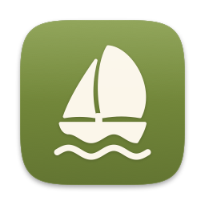
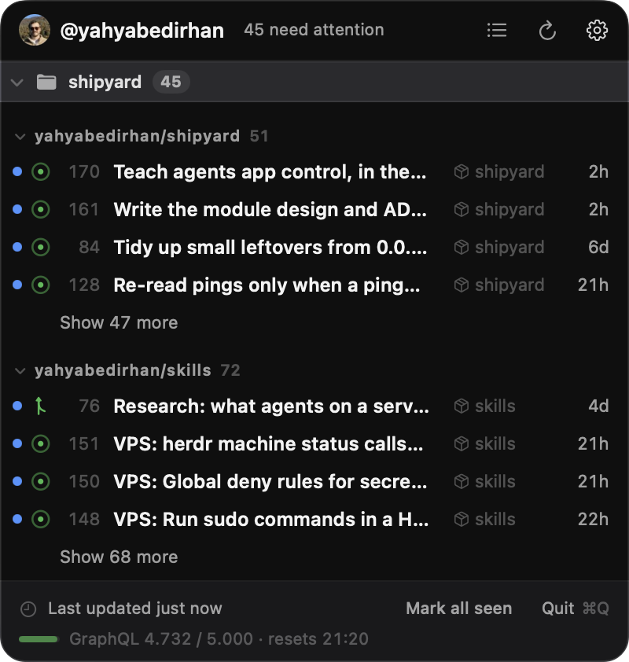
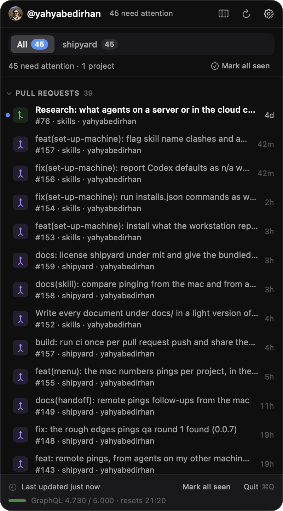
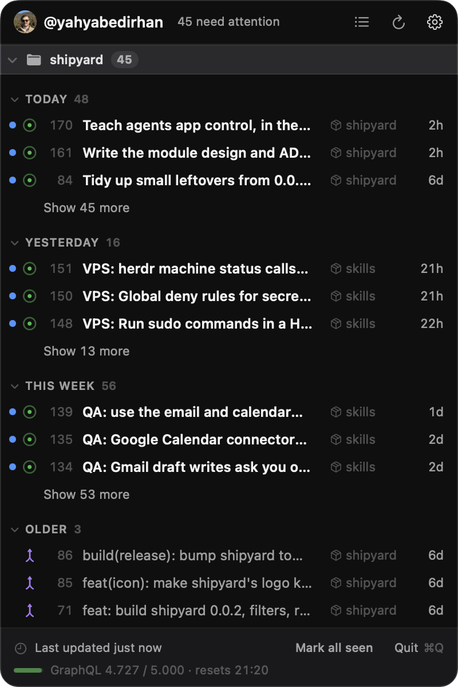
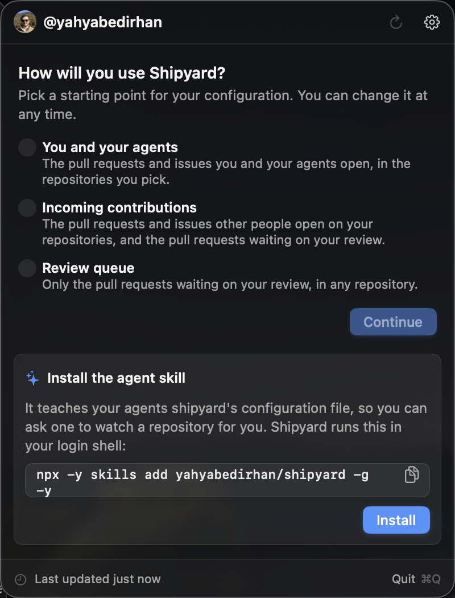

<p align="center"></p>

<h1 align="center">shipyard</h1>

A macOS menu bar app for seeing and reviewing the pull requests your agents open on your behalf.

**Status:** under construction; this README describes 0.4.0.

## Why it exists

Coding agents open pull requests and issues and start workflow runs, often several at once across several repositories. Keeping up means checking GitHub page after page. Shipyard lists them in the menu bar, from anyone, and shows one number: how many items are new, changed since you last opened them, waiting on your review, or failing their checks. It can notify you when something happens, and your agents can ping you when they need you. What it shows lives in one TOML file that you, or your agents, edit.

## Install

You need macOS 14 or later and a GitHub account. Building from source also needs the Command Line Tools with Swift 6 (`xcode-select --install`).

From source:

```sh
git clone https://github.com/yahyabedirhan/shipyard.git
cd shipyard
make install    # builds, signs and copies Shipyard.app to /Applications, then opens it
```

Or download `Shipyard-<version>-macos.zip` from the [latest release](https://github.com/yahyabedirhan/shipyard/releases/latest). It isn't notarized, so clear the quarantine flag before the first launch:

```sh
unzip Shipyard-<version>-macos.zip
mv Shipyard.app /Applications/
xattr -dr com.apple.quarantine /Applications/Shipyard.app
open /Applications/Shipyard.app
```

To update, run `git pull && make install` again, or replace the app with a newer zip. To uninstall, quit shipyard and delete the app and its files:

```sh
rm -rf /Applications/Shipyard.app ~/.config/shipyard ~/Library/Application\ Support/Shipyard
```

If you signed in with GitHub, choose **Sign out** in the gear menu before deleting the app, and remove the agent skill with `npx skills remove shipyard -g` if you installed it.

## Use

Shipyard lives in the menu bar, with no Dock icon. On first launch the panel asks you to connect GitHub: **Sign in with GitHub**, or use the [GitHub CLI](https://cli.github.com) if `gh` is signed in. It then offers three starting configurations, called presets, and asks which repositories to watch.

- Click an item to open it on GitHub and mark it seen; **⌥-click** marks it seen without opening it.
- **↑**, **↓** and **Return** move through the items and open one; **⌘R** refreshes.
- Shipyard starts at login. Set `launch-at-login = false` to stop that.

## Configure

Everything lives in `~/.config/shipyard/config.toml`; **Open configuration file** in the gear menu opens it. Every key is optional and each save applies at once. A broken edit keeps the last good configuration and shows the error in the panel.

The file sets the projects (each a section of the menu with its repositories), the layout (`list` or `tabs`), what's shown (pull requests, issues, workflow runs, and whose), how items are grouped and sorted, and which events notify you. [`skills/shipyard/SKILL.md`](skills/shipyard/SKILL.md) lists every key, its default and its allowed values, with worked examples; [`skills/shipyard/presets.md`](skills/shipyard/presets.md) has the three presets in full; and [`docs/configuration.md`](docs/configuration.md) explains how configuration works in the code, for maintainers.

## Use it with an agent

Shipyard ships an agent skill that teaches coding agents (Claude Code, Codex and others that read skills) to edit its configuration file. Install it from the panel's gear menu (**Install agent skill…**) or from a terminal:

```sh
npx skills add yahyabedirhan/shipyard -g -y
```

Then ask in your own words: "Watch this repo in shipyard", "Hide dependabot's pull requests", "Tell me when CI fails on this project", "Switch shipyard to tabs". The agent edits the file, checks it against the schema, and reads shipyard's verdict on the save.

### Pings

Agents can also ping you: a short message listed under the project they're working in, with a notification, that takes you where they mean when you click it. It opens a link, brings an app forward, or focuses the agent's Herdr tab. They send it with the `shipyard` command that comes inside the app; link it onto your PATH from onboarding or the gear menu (**Link shipyard CLI…**), which puts it at `~/.local/bin/shipyard`.

```sh
shipyard ping "PR #57 is ready for review" --from claude --open https://github.com/my-org/shop/pull/57
shipyard ping "Waiting for your input" --herdr --id shop-question   # brings you back to this Herdr pane
shipyard ping withdraw shop-question                                # takes it back once you've answered
```

A ping is filed under the projects that watch the repository of the agent's working folder, needs attention until you click it, and leaves a day after you've seen it (`seen-window`), or when you dismiss it with its ✕. Pings never reach GitHub. With the skill installed, ask "ping me when the PR is ready" and the agent knows the rest; `shipyard ping --help` lists every flag. If your `config.toml` lists its own notification rules, add `{ event = "ping.sent" }` to hear about pings.

#### Pings from your other machines

Agents on your other machines can ping you too, when your Mac's Herdr knows those machines as saved machines. Install the [herdr-shipyard](https://github.com/yahyabedirhan/herdr-shipyard) plugin on each one, which puts the same `shipyard` command there:

```sh
herdr plugin install yahyabedirhan/herdr-shipyard
```

Then name them in `config.toml` by their Herdr labels:

```toml
[remote]
machines = ["hetzner-vps"]
```

Shipyard asks each machine for its pings through Herdr about every 30 seconds and files them under the projects that watch their repositories, or under the machine's name. Clicking one sent from a Herdr pane takes you to that agent. On those machines the plugin also pings you by itself when Herdr marks an agent blocked, and takes the ping back when the agent goes on. A machine that doesn't answer shows a quiet line and keeps its last pings.

One known limit, with Herdr 0.9.3: clicking a machine's ping focuses its pane on that machine, but your Mac's Herdr window only moves there when it's already showing that machine. When it's showing your Mac or another machine, nothing visible happens and the ping is marked seen; switch Herdr to that machine yourself to see the pane. Herdr has no command yet that switches an open window to a saved machine, so shipyard can't do it for you.

### Notes

Your own notes, kept in Notion, list under each project too: one database per project, titled with the project's name, under a "Projects" page inside a "Shipyard Notes" page. Dictate a note to any agent and it writes it there; the menu lists each project's open notes, newest first, with their numbers (`SHOP-7`) and labels, and clicking one opens it in Notion, as the project's notes count opens its database. The pencil icon on a project's header starts a note there: it creates the project's database the first time, then an empty note, and opens it in Notion for you to type or dictate. Notes never need attention. The app reads and writes notes through [`ntn`](https://developers.notion.com/cli/get-started/overview), Notion's CLI, with ntn's own login, and keeps no Notion token of its own: install ntn (`curl -fsSL https://ntn.dev | bash`), run `ntn login` in Terminal and choose your notes workspace, and check with `ntn doctor` that it's ntn's default workspace. The notes are read every minute and whenever you open the menu. Until ntn is installed and logged in, or while its workspace has no Shipyard Notes page, a banner says what to do. `shipyard notes check` reads the workspace the way the app does and reports what's wrong with it. `notes = { show = false }` in a project's block keeps its notes out.

## Examples

Each configuration below produced the screenshot under it, trimmed to the lines that matter. The first three watch two repositories as one project, with issues turned on.

The list layout, grouped by repository under subheaders, four rows a group:

```toml
[menu]
layout = "list"
[defaults]
group-by = "repository"
subsections = true
show-first = 4
[defaults.issues]
show = true
[[projects]]
name = "shipyard"
repositories = ["yahyabedirhan/shipyard", "yahyabedirhan/skills"]
```



The same file in the tabs layout. The All tab always groups by kind; each project's tab follows its configuration:

```toml
[menu]
layout = "tabs"
[defaults]
group-by = "repository"
subsections = true
show-first = 4
[defaults.issues]
show = true
[[projects]]
name = "shipyard"
repositories = ["yahyabedirhan/shipyard", "yahyabedirhan/skills"]
```



Grouped by date, three rows a group:

```toml
[menu]
layout = "list"
[defaults]
group-by = "date"
subsections = true
show-first = 3
[defaults.issues]
show = true
[[projects]]
name = "shipyard"
repositories = ["yahyabedirhan/shipyard", "yahyabedirhan/skills"]
```



A file with no projects (or no file at all): the panel asks how you'll use shipyard, offers the three presets, and offers the agent skill:

```toml
version = 1
```



## Changelog

What changed in each version, with its pull requests, is in [`CHANGELOG.md`](CHANGELOG.md).

## Development

`make test` runs the tests, and `make release` builds the release zip. With the Command Line Tools alone, the first build compiles the SDK's Swift modules (about 40 s); the `Makefile` keeps them in `~/Library/Caches/shipyard/ModuleCache`, so every other checkout and worktree reuses them. Installing Xcode avoids the cost, since it ships them prebuilt. Publishing a GitHub release runs the [`linux cli`](.github/workflows/linux-cli.yml) workflow, which attaches static Linux builds of the `shipyard` command (`shipyard-linux-x86_64`, `shipyard-linux-aarch64` and their `.sha256` files) to it; run it by hand to get the same files as workflow artifacts.

Releases follow the steps in the Releases section of [`AGENTS.md`](AGENTS.md), and each one gets an entry in [`CHANGELOG.md`](CHANGELOG.md).

The design is in [`docs/low-level-design.md`](docs/low-level-design.md), the glossary in [`GLOSSARY.md`](GLOSSARY.md).

### Forks: your own OAuth App

Sign in with GitHub uses the OAuth App client ID compiled into the build. A fork should use its own: create an OAuth App on GitHub (**Settings > Developer settings > OAuth Apps**), tick **Enable Device Flow**, and put its client ID in `OAuthApp.clientID` in `Sources/ShipyardCore/GitHub/Auth/DeviceFlow.swift`. Without one, the build connects through `gh` only. See [`docs/references/github-device-flow.md`](docs/references/github-device-flow.md) for GitHub's limits.

## License

MIT, see [`LICENSE`](LICENSE). The bundled agent logos are their owners'; see [`THIRD-PARTY-NOTICES.md`](THIRD-PARTY-NOTICES.md).
